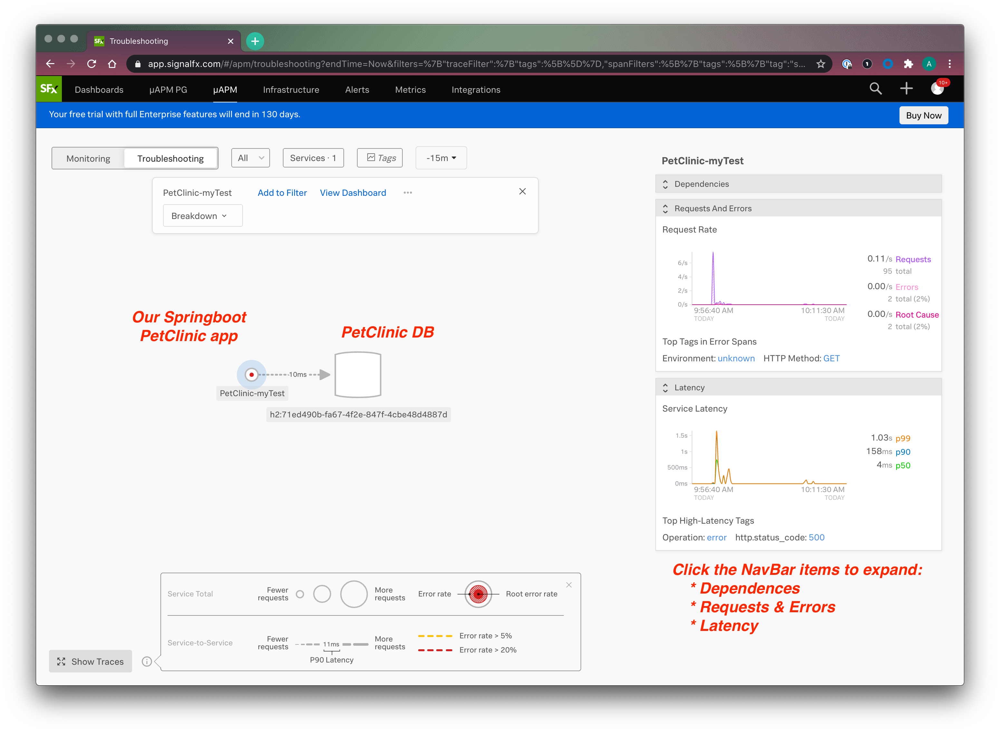

# Instrumenting Petclinic with SignalFx
### SignalFX Infrastructure, µAPM, and Tracing

## Overview
Steps to deploy a sample Springboot application and enable SignalFx for Infrastructure, APM, and Tracing functionality. 

## Requirements
* SignalFx trial account
    * OrgID
    * Access Token
    * Realm
* a compute resource to install onto - ec2, droplet, bare metal with external network access

## Setting up the sample application
### Understanding the Spring Petclinic application with a few diagrams
<a href="https://speakerdeck.com/michaelisvy/spring-petclinic-sample-application">See the presentation here</a>

### Running Pet Clinic
Petclinic is a [Spring Boot](https://spring.io/guides/gs/spring-boot) application built using [Maven](https://spring.io/guides/gs/maven/). You can build a jar file and run it from the command line:

```
git clone https://github.com/spring-projects/spring-petclinic.git
cd spring-petclinic
./mvnw package
java -jar target/*.jar
```
You can then access petclinic here: http://HOST_IP:8080/ . Once you have clicked around and gotten familiar with it, feel free to ctrl-c to shut Pet Clinic down for now.


## Deploy SignalFx
### 1. Install the Smart Agent
The SignalFx Smart Agent collects metrics from the host that it is on, as well as collecting metrics and traces from the instrumentation library.

The following command will download and configure the SignalFx Agent and start it. Go ahead and run this on your compute resource:

```
curl -sSL https://dl.signalfx.com/signalfx-agent.sh > /tmp/signalfx-agent.sh
sudo sh /tmp/signalfx-agent.sh --realm <YOUR_SignalFX_REALM> -- <YOUR_SignalFx_TOKEN>
```
_Link to the prefilled instructions directly in your SignalFx UI: https://app.signalfx.com/#/integrations?selectedKeyValue=custom:signalfx-agent&tab=Setup_

Confirm the Smart Agent is running:
```
sudo signalfx-agent status
```

The output should look similar to:
```
ubuntu@quji:~$ sudo signalfx-agent status
SignalFx Agent version:           5.5.1
Agent uptime:                     2m22s
Observers active:                 host
Active Monitors:                  10
Configured Monitors:              10
Discovered Endpoint Count:        19
Bad Monitor Config:               None
Global Dimensions:                {AWSUniqueId: i-01ffb035ab6ee9b61_ap-southeast-2_919811507528, host: quji.local}
GlobalSpanTags:                   map[]
Datapoints sent (last minute):    288
Datapoints failed (last minute):  0
Datapoints overwritten (total):   0
Events Sent (last minute):        6
Trace Spans Sent (last minute):   0
Trace Spans overwritten (total):  0

Additional status commands:

signalfx-agent status config - show resolved config in use by agent
signalfx-agent status endpoints - show discovered endpoints
signalfx-agent status monitors - show active monitors
signalfx-agent status all - show everything 
```

You should be able to see your host in the SignalFx UI. Go to *Infrastructure* > Sidebar > Hosts (Smart Agent / collectd)


You can also take a look at the logs for the Smart Agent:

For sysv/upstart hosts, run:
* `tail -f /var/log/signalfx-agent.log`

For systemd hosts, run:
* `journalctl -u signalfx-agent -f`


### 2. Next deploy the auto instrumentation library for APM and tracing
Download the latest version from our release page:
* https://github.com/signalfx/signalfx-java-tracing/releases

The following command will download v0.48.0 to the local instance. Please update your version based on the newest version from the previous link. 

Run the following from within the `spring-petclinic` directory that we have been working in. This will download the desired Sfx agent into our directory:

```
curl -LJO https://github.com/signalfx/signalfx-java-tracing/releases/download/v0.48.0-sfx1/signalfx-tracing.jar
```

And the working directory should look like:
```
ubuntu@quji:~/spring-petclinic$ ls
docker-compose.yml  mvnw  mvnw.cmd  pom.xml  readme.md  signalfx-tracing.jar  src
ubuntu@quji:~/spring-petclinic$
```

## 3. Configure PetClinic to start with the instrumentation library
Set the required environment variables or system properties for your application. For more information about the required environment variables, see the Configuration values. Set this environment variable from the command line:
```
$ export SIGNALFX_SERVICE_NAME="PetClinic-myTest"
$ export SIGNALFX_ENDPOINT_URL='http://localhost:9080/v1/trace'
$ export SIGNALFX_SPAN_TAGS="environment:local"

```
> **Protip:** if you don't set that environment tag at the app level, then metrics > > correlation breaks at the agent level. The metrics that get the sf_environment tag > > on K8s depend on the trace forwarder already having an environment tag

Now, start the Pet Clinic application with our Java instrumentation library sending its data to the Smart Agent. For example:
```
$ java -javaagent:signalfx-tracing.jar -jar target/spring-petclinic-2.3.0.BUILD-SNAPSHOT.jar
```

> **Protip:** Remember that auto-instrumentation is configured to `localhost:9080`.
> If you need to change this (e.g. for serverless) you would set the
> `SIGNALFX_ENDPOINT_URL` environment variable.


You can expect to see output similar to the following when PetClinic has succesfully started.

```
INFO 31229 --- [           main] DeferredRepositoryInitializationListener : Spring Data repositories initialized!
INFO 31229 --- [           main] o.s.s.petclinic.PetClinicApplication     : Started PetClinicApplication in 26.274 seconds (JVM running for 32.576)
```

## 4. Generate traffic to the PetClinic application
Goto http://HOST_IP:8080/ and click around the site performing the following actions:
1. go to Find Owners
    * attempt a lookup against an Owner name
    * create a new Owner
2. Click on the Veterinarians tab
3. Click on Error to generate an serverside error
    * verify output in the PetClinic console

## 5. View the data generated within SignalFx
Click on µAPM and you should see the PetClinic service appear in the map along with a database dependency.

From the Monitoring tab, click on the PetClinic Service circle itself to select it. You will be able to see the built-in service dashbaord for it by clicking on *View Dashboard*.  
Some charts may not populate until enough data has been sent for a sustained period of time.


Click on *Troubleshooting* to enter the view where we can see traces and the more granular level data about our PetClinic.



Click on either the *Requests And Errors* navbar item or the *Latency* navbar item to view more detail. Here you can determine what the throughput, latency, or error rate for a particular service is.


You can even click and drag over an interesting part or peak in the map to isolate the important data from the noise.

<p align="center">
.
</p>

Click on a trace to view a single request as it touches various spans within an application. SignalFx instrumentation is able to pick calls to common libraries and frameworks.

https://github.com/signalfx/signalfx-java-tracing#requirements-and-supported-software

<p align="center">
.
</p>

Click into the various spans to view the _span tags_ and _process tags_ associated with each span. You can unfurl each span to provide finest grained visibility into the path of the trace and metadata about each span in code.

<p align="center">

</p>
